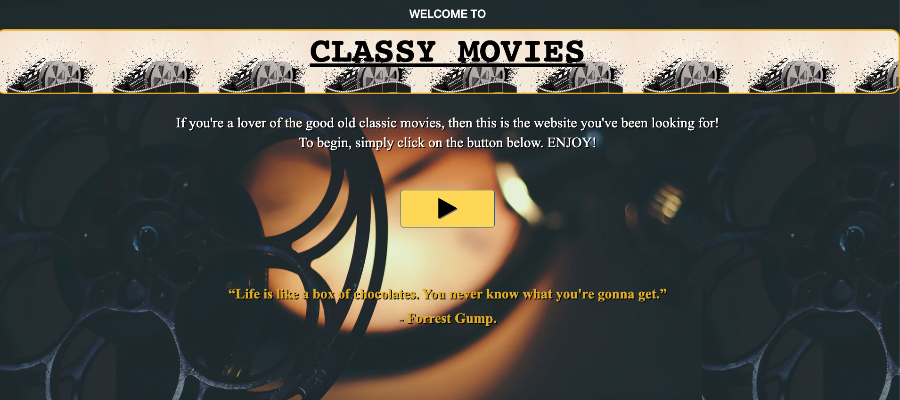
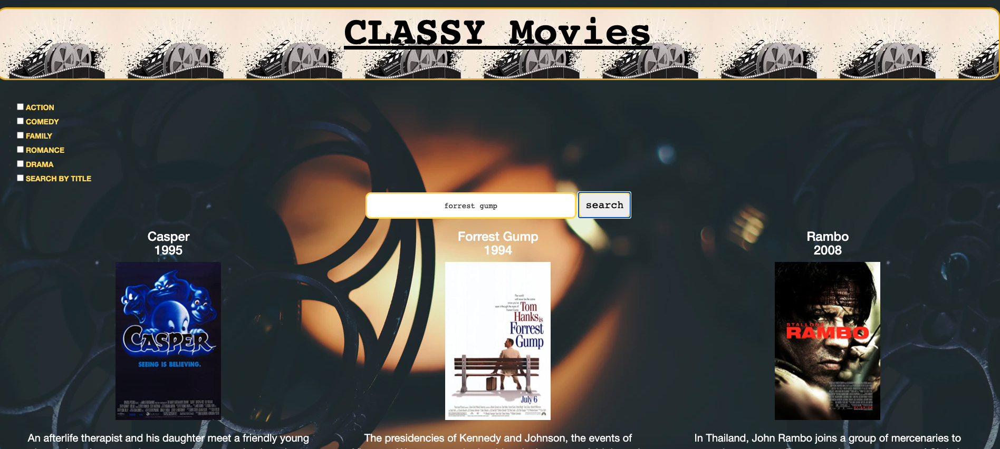
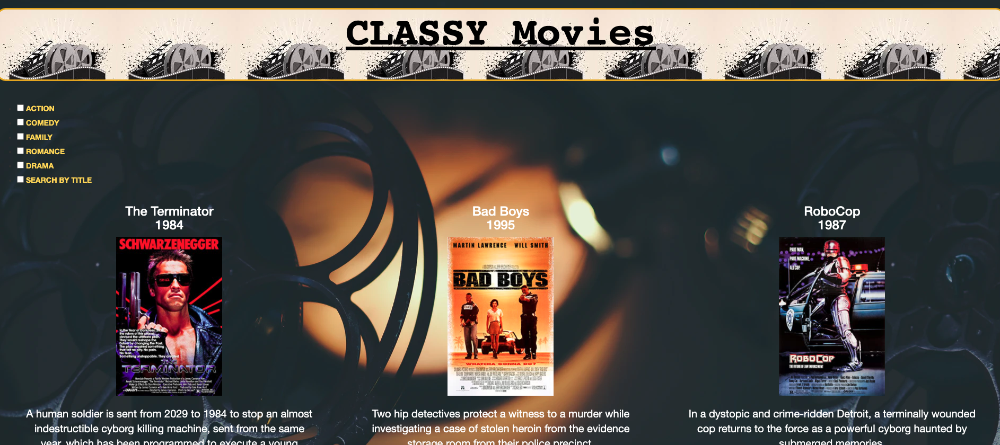

# Classy Movies

## Contributors

* Kevin Floris
* Jennifer Mendez (jenniferjael)
* Esteban Mendez (Esmendez90)

## User Story

As a user, who loves good old classy movies, I want the application to:  

1. Display the data of the movie that I search for. This includes movie title, year, poster, and plot. 
2. Be able to click on a specific genre and get a list of movies for the genre that I clicked on.
3. Be able to click on the poster of the movie and be directed to a youTube video trailer of that movie. 

## Table of Content

* [Motivation](#motivation)
* [Description](#description)
* [Screenshots](#screenshots)
* [Link to Page](#link-to-page)
* [Tools](#tools)

## Motivation

We want users to be able to quickly find classic movies that they loved when they were younger, and that can bring back fond memories of their childhood, time in high school, or simply any other memory that reminds them how things were back then.

## Description

Create a Classy Movie application that allows you to search for any classic movies. This app will run in the browser and feature dynamically updated HTML and CSS powered by jQuery. Use omdb movie api to write code that requests the movie data, and themoviedb api to write code that requests the movie trailer.

## Screenshots

## Link to Page

<https://esmendez90.github.io/classy-movies/>

## Tools

* OMDB API <https://www.omdbapi.com/>.
* themoviedb API <https://www.themoviedb.org/documentation/api>
